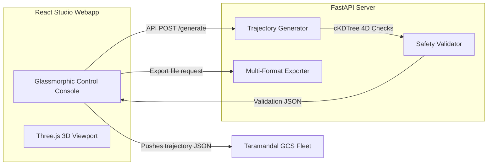

# 🛸 Taramandal Studio: Swarm Choreography Engine

Taramandal Studio is an industry-grade swarm choreography generator and 3D visualizer. It provides drone show designers with parametric tools to generate, preview, safety-validate, and export complex multi-vehicle flight trajectories.

---

## 🎨 System Overview



---

## 📐 Parametric Shape Math Specifications

The Studio engine generates time-ordered waypoints $(t, x, y, z, \psi)$ at a configured sample rate ($R$ Hz). Drones launch from spacing-aligned pads on the ground, climb to separate target hover altitudes, execute the shape, and land back on their home pads.

### 1. Rotating Circle
Drones are spaced out evenly along the perimeter of a circle:
$$\theta_i(t) = \frac{2\pi \cdot i}{N} + \frac{2\pi \cdot t}{T_{\text{choreo}}}$$
$$x_i(t) = X_c + r \cdot \cos(\theta_i(t))$$
$$y_i(t) = Y_c + r \cdot \sin(\theta_i(t))$$
$$z_i(t) = -Z_{i,\text{hover}}$$
where $N$ is the number of drones, $T_{\text{choreo}}$ is the circular choreography period, and $(X_c, Y_c)$ is the arena center.

### 2. 3D Helix (Spiral)
Combines circular rotation with height oscillation:
$$z_i(t) = -\left(Z_{i,\text{hover}} + A_{\text{osc}} \cdot \sin\left(\frac{2\pi \cdot t}{T_{\text{osc}}} + i\right)\right)$$
Adding vertical sinusoidal oscillation creates a shifting double-helix swarm pattern.

### 3. Spinning Heart
Follows the classic 2D parametric cardiod:
$$hx(\theta) = 16 \cdot \sin^3(\theta)$$
$$hy(\theta) = 13 \cdot \cos(\theta) - 5 \cdot \cos(2\theta) - 2 \cdot \cos(3\theta) - \cos(4\theta)$$
Drones map to the cardiod perimeter and rotate around the Z-axis dynamically.

---

## 🚨 Pre-flight 4D Safety Validation

Before any trajectory is cleared for push/export, the choreography is evaluated step-by-step ($\Delta t = 0.1$s) against strict flight safety constraints using high-performance spatial partitioning (`scipy.spatial.cKDTree`):

1. **Proximity Checks**: Ensures no two drones drift within the safety threshold ($d < 0.8$m).
2. **Velocity Checks**: Compares consecutive waypoints to verify speed remains within limits ($v \le 6.0$ m/s).
3. **Acceleration Checks**: Monitors acceleration changes ($a \le 50.0$ m/s²).
4. **Yaw Rate Checks**: Validates yaw spin limits ($\dot{\psi} \le 300.0$ deg/s).

---

## ⚙️ How to Run

### Setup Virtual Environment
```bash
python3 -m venv .venv
source .venv/bin/activate
pip install -r requirements.txt
```

### Start Backend Engine (Port 8001)
```bash
PYTHONPATH=. python studio/server.py
```
*Configurable via `STUDIO_HOST` and `STUDIO_PORT` environment variables.*

### Start Visualizer UI (Port 5174)
```bash
cd frontend
npm install
npm run dev -- --host 0.0.0.0 --port 5174
```

---

## 🎬 Blender Trajectory Exporter

For animations custom-designed in **Blender**, `studio/blender_export.py` can be run inside Blender's python runtime (`bpy`) to scrape keyframes:
```bash
blender --background my_show_scene.blend --python studio/blender_export.py -- my_trajectory.json
```
Ensure your Blender objects are named `Drone_00`, `Drone_01`, etc. The script automatically translates Blender coordinates (positive-Z up) to PX4 local NED coordinates (negative-Z up).
